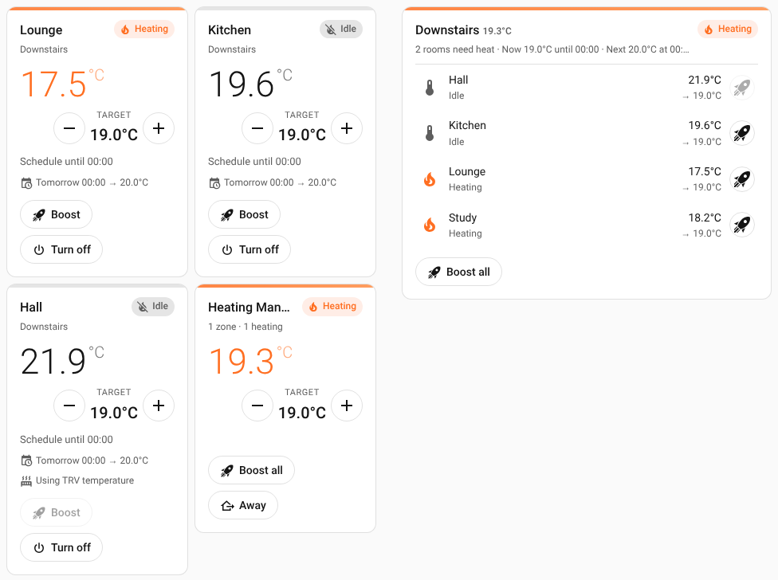
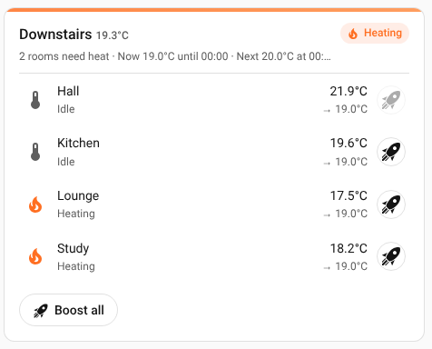

# Heating Manager cards

Dashboard cards for the [Heating Manager](https://github.com/vatons/heating_manager) integration for Home Assistant.

- **Heating Manager room** (`custom:heating-room-card`): one room, a zone or the whole house. Temperature, target with − / + buttons, boost with a live countdown, on/off, the next schedule change, trend and time to target.
- **Heating Manager zone** (`custom:heating-zone-card`): a zone and all of its rooms, found automatically. Each room shows its temperature, target and status, with its own boost button.

Both cards have a visual editor, so you don't need YAML.

## Requirements

| | Version |
|---|---|
| Home Assistant | 2025.7 or later (tested on 2026.10) |
| Heating Manager | 3.2 or later |

Version 2 of the cards works with the entities Heating Manager 3.x creates (`climate.downstairs`, `climate.downstairs_lounge`, …). For Heating Manager 1.x and 2.x (`climate.<room>_hm`), use version 1.0 of the cards.

## Installation

### HACS (recommended)

1. In HACS, open the menu (⋮) → **Custom repositories**, add `https://github.com/vatons/heating_manager_ui` with type **Dashboard**.
2. Search for **Heating Manager cards** and download it. HACS adds the dashboard resource for you.
3. Reload your browser.

### Manual

1. Copy `heating-manager-ui.js` to `/config/www/heating-manager-ui.js`.
2. Go to **Settings → Dashboards → ⋮ → Resources → Add resource**, enter `/local/heating-manager-ui.js` and choose **JavaScript module**.
3. Reload your browser.

## Adding a card

1. Edit a dashboard and choose **Add card** (in a sections view, the **+** in a section).
2. Choose **By card** and search for **Heating Manager**. The previews show your own rooms and zones.
3. Pick **Heating Manager room** or **Heating Manager zone**, then choose the room or zone. The entity list only shows Heating Manager entities.

## What the cards show

### Room card



- **Temperature** and **target**. Use − / + to change the target: the card waits a second after your last tap and then sends one change, so tapping + three times sends one update. Steps are 0.5 °C (1 °F).
- **Status**: what the room is following, such as `Schedule until 17:00`, `Manual until 17:00`, `Boost · 42:10 left to 21.0°C`, `Away · frost protection` or `Off`.
- **Chip**: `Heating`, `Idle`, `Off`, or `Monitoring` for rooms in a monitoring-only zone.
- **Details**: the next schedule change, the temperature trend, the time to reach the target when the room is heating (`rough estimate` when the integration's confidence is under 50%), sensors that have stopped reporting, and `Using TRV temperature` for rooms without a sensor.
- **Buttons**:
  - **Boost** starts a boost for the integration's boost duration (or `boost_duration`); **Cancel boost** ends it. Rooms without a temperature sensor can't be boosted, so the button is disabled there.
  - **Resume schedule** appears after you change the target, and clears the manual temperature.
  - **Turn off / Turn on** switches the room off (its TRVs are held at the minimum and it never calls for heat) or back on. Boosting a room that's off turns it back on.

Changes show on the card straight away. Heating Manager refreshes at most every 10 seconds, so the card keeps showing your change until the entity catches up (or for 15 seconds). If Home Assistant rejects a change, the card goes back and shows why.

In away mode, targets are frost protection, so the target buttons are hidden and you can't start a boost. A boost that was already running can still be cancelled.

### Zone and whole-house entities on the room card

Pick a zone (e.g. `climate.downstairs`) or `climate.heating_manager` for the whole house:

- The average temperature and target. − / + set a manual temperature for the zone (or every zone).
- How many rooms need heat, the schedule, and boiler protection holds (`Heating (min on)`, `Waiting (min off)`).
- **Boost all** boosts every room with a sensor; **Cancel boosts** goes back to the schedule (clearing boosts and manual temperatures).
- The whole-house card has **Away** to switch away mode on or off for every zone.

### Zone card



Lists every room in the zone with its temperature, target and status. Rooms you add to the zone later appear without editing the card. Tap a room for its details, or its rocket to boost it. **Boost all** / **Cancel boosts** act on the whole zone.

## Options

### Room card

```yaml
type: custom:heating-room-card
entity: climate.downstairs_lounge   # a room, a zone or climate.heating_manager
```

| Option | Default | Description |
|---|---|---|
| `entity` | required | A Heating Manager climate entity |
| `name` | room name | Name shown on the card. Room names are shown without their zone (`Lounge`, not `Downstairs Lounge`) |
| `show_controls` | `true` | Target − / + and the buttons |
| `show_schedule` | `true` | The next schedule change |
| `show_analytics` | `true` | Trend and time to target |
| `boost_duration` | integration setting | Boost length in minutes |
| `tap_action` | `more-info` | [Action](https://www.home-assistant.io/dashboards/actions/) when the card is tapped |
| `hold_action` | `none` | Action when the card is held |

### Zone card

```yaml
type: custom:heating-zone-card
entity: climate.downstairs
```

| Option | Default | Description |
|---|---|---|
| `entity` | required | A Heating Manager zone entity |
| `name` | zone name | Name shown on the card |
| `rooms` | all rooms | Room entities to show, in this order |
| `show_controls` | `true` | Boost buttons |
| `show_room_boost` | `true` | A boost button on each room |
| `boost_duration` | integration setting | Boost length in minutes for the room buttons |
| `tap_action` | `more-info` | Action when the zone's title is tapped |

See [example-dashboard.yaml](example-dashboard.yaml) for more.

## Theming

The cards use your theme's colours. To change them, set these in your theme (see [example-theme.yaml](example-theme.yaml)):

| Variable | Used for | Default |
|---|---|---|
| `heating-color` | Heating status, temperature and bar | `state-climate-heat-color`, else `#ff6b35` |
| `heating-color-light` | End of the heating bar's gradient | `#ff8c42` |
| `heating-color-alpha` | Heating chip background | `rgba(255, 107, 53, 0.12)` |
| `boost-color` | Active boost and away buttons | `heating-color` |
| `cool-color` | Cooling trend | `info-color` |

## Upgrading from 1.0

- Entities: use the Heating Manager 3.x entities (`climate.downstairs_lounge`). Cards no longer guess rooms and zones from entity IDs, so zones named anything work.
- `heating-manager-ui-editor.js` is gone; the editor is built into `heating-manager-ui.js`. If you added it as a resource, remove it.
- Boost now uses `heating_manager.set_boost` (one call) instead of setting the preset and then the temperature.
- Temperatures follow your unit system (°C or °F).

## Troubleshooting

**The card says "isn't a Heating Manager entity"**: choose one of the climate entities Heating Manager creates for its rooms and zones, not a TRV.

**"Waiting for Heating Manager…"**: the integration is starting and hasn't updated its rooms yet. It clears by itself.

**Boost is greyed out**: the room has no temperature sensor (add one in the zone's form on the Heating Manager integration page), or away mode is on.

**The card doesn't appear after updating**: reload the browser, clearing its cache if needed. The browser console shows `HEATING-MANAGER-UI v2.0.0` when the new version is loaded.

## Development

The cards are a single JavaScript module with no build step and no dependencies. There are three test suites:

| Suite | What it checks | Command |
|---|---|---|
| Unit | Rendering, buttons, optimistic updates, editors, °C/°F, away, errors (Vitest + happy-dom) | `npm test` |
| Contract | The real Heating Manager integration on Home Assistant: records the entity states the unit tests use (`test/fixtures/`) and runs every service call the cards make (`test/fixtures/service-calls.json`) | `npm run test:contract` |
| End to end | Starts Home Assistant with its frontend and Heating Manager, then uses the cards in Chromium: boost, target, on/off, away, more info, the card picker and both editors. Screenshots go to `e2e/screenshots/` | `npm run test:e2e` |

```bash
npm install
npm test

# Contract and end-to-end tests need Python 3.14 and a Heating Manager checkout
# next to this repository (or HM_BACKEND=/path/to/heating_manager)
uv venv --python 3.14 .venv
uv pip install --python .venv/bin/python -r contract/requirements.txt
(cd contract && ../.venv/bin/pytest)
UPDATE_FIXTURES=1 npm run test:contract   # after an integration change, re-record the fixtures

uv venv --python 3.14 .venv-e2e
uv pip install --python .venv-e2e/bin/python -r e2e/requirements.txt
HA_PYTHON=.venv-e2e/bin/python npm run test:e2e
```

The end-to-end test uses Home Assistant's default port, 8123. Set `CHROMIUM` to a Chromium binary if Playwright's isn't installed.

## License

MIT. See [LICENSE](LICENSE).
